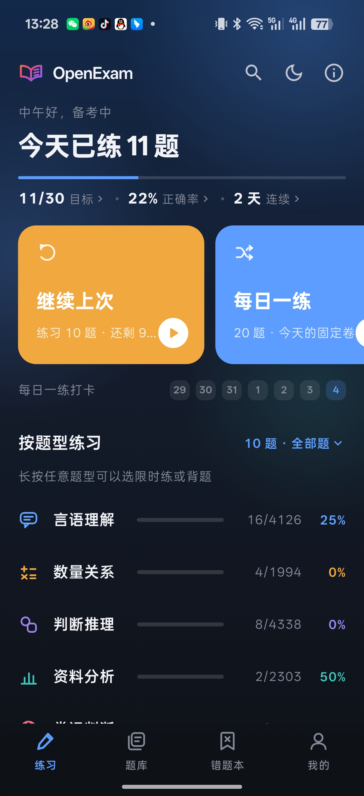
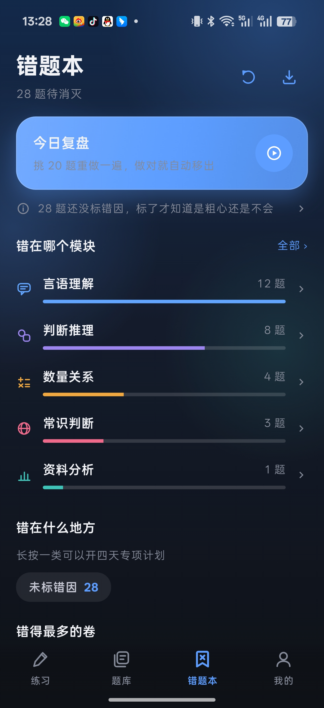
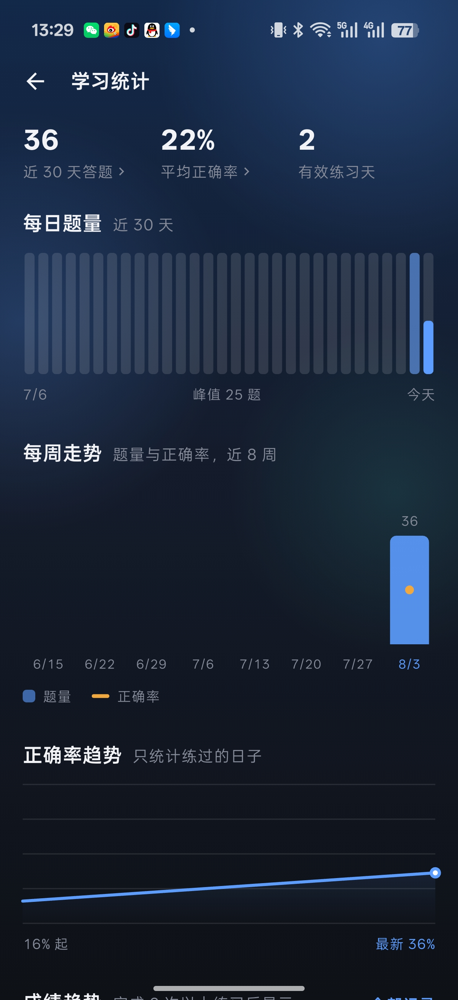
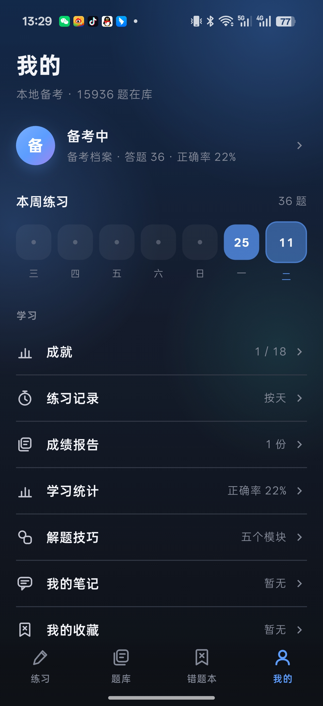
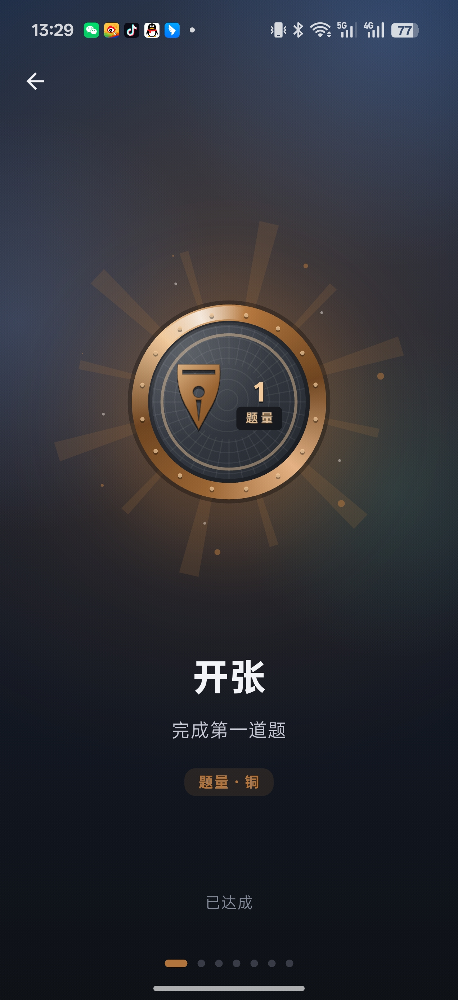
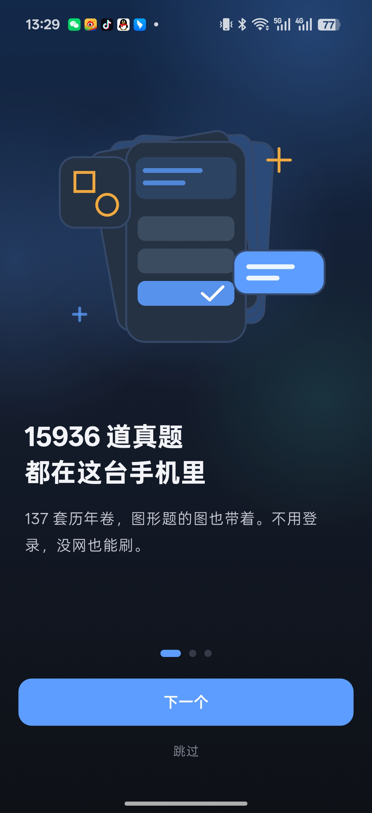

<p align="center">
  
</p>

<h1 align="center">OpenExam App</h1>

<p align="center">
  离线刷题 App · 真题按卷刷、错题按错因练
</p>

<p align="center">
  
  
  
  
</p>

---

## 这是什么

自己备考时写的刷题手机端，配套的桌面端在另一个仓库。

做题、按卷模考、错题复盘、成绩统计这一套都在里面。题库随安装包分发，装完就能用，不用注册，不用联网；答题记录、错题、笔记、成就都存在手机上，可以导出成 JSON 拿走。

目前内置的是行测题库：15936 道真题、137 套历年卷、4230 张图（图形推理和资料分析的图都在），分言语理解、数量关系、判断推理、资料分析、常识判断五个模块。题库本身和 app 是分开的 —— 换一个题库就是换一门考试，见下面的 Roadmap。

## 截图

<p align="center">
  
  
  
</p>
<p align="center">
  <sub>练习首页 · 错题本 · 学习统计</sub>
</p>

<p align="center">
  
  
  
</p>
<p align="center">
  <sub>我的 · 成就徽章 · 引导</sub>
</p>

## 主要功能

### 练

- **每日一练**：按日期确定的固定卷，同一天打开永远是同一组题；七天打卡条，断掉的那天可以补做
- **弱项强化**：按各模块正确率加权抽题，不用自己猜该练哪块
- **限时模考 / 单模块限时练**：按各模块的考场配速换算时长（言语 55s、数量 75s、判断 50s、资料 70s、常识 20s 每题）
- **按卷刷**：试卷详情能看模块分布，可以只练其中一个模块、只练空题、只练错题
- **背题**：不作答，直接翻答案和解析
- 做题页没有底部工具条：选中答案即进入下一题，左右滑动切换；草稿纸、计算器、笔记、存疑标记都在顶栏

### 复盘

- **错题本概览优先**：进去先看今日复盘、模块分布、错因分布、错得最多的卷，逐题列表要点底部进 —— 一打开就是密密麻麻的错题，没人愿意复盘
- **错因标签**：粗心 / 不会 / 审题 / 没时间，可多轴筛选（题型 × 错因 × 来源卷 × 难度）
- **四天专项计划**：同一类错因连着盯四天 —— 前两天不计时慢做，第三天限时加压，第四天掺同类新题混练验证
- **难度自评**：解析下面标简单 / 一般 / 难，之后能把标难的单独拉出来重练
- **本题历史作答**：答完当场显示这题做过几次、错过几次、最近 5 次分别选了什么
- **导出**：错题可导出 Markdown，全部数据可导出 JSON 备份

### 看

- **备考档案**：正确率环、模块分布、35 天热力图、成绩走势、时段分布
- **弱项诊断**：最近 7 天 vs 前 7 天的模块对比，退步或进步 8 个点以上直接点名并附具体数字；每条建议带自己的出口（跳错题本、直接开限时练）
- **成就**：18 枚徽章分 5 组 4 个等级，全部按本机数据计算，整页展示可左右滑动

## 设计

界面规范写在 [docs/DESIGN.md](docs/DESIGN.md)，几条自己定的规矩：

- 不用 `BackdropFilter`。真实高斯模糊在中端机上掉帧，玻璃质感靠渐变、描边和阴影堆出来
- 少画卡片和边框，背景本身就是层次，能用留白分组就不画框
- 图标全部手绘。20 个描边图标、勋章纹样、引导插画、图表都是 `CustomPainter`，没有图标字体依赖

## 技术

Flutter 3.32 / Dart 3.8，Material 3，自建 `ThemeExtension` 令牌系统做浅色、深色和跟随系统。

题库是桌面端导出的 SQLite 库，gzip 后随安装包分发，首次启动在独立 isolate 里解包到本地，之后全部走 sqflite。图片以 BLOB 存在同一个库里，用 `oeimg://` 协议引用，前面挂了个 12MB 的 LRU 内存缓存。

依赖只有 sqflite、path_provider、shared_preferences、file_picker —— 没有网络库。

目录结构：

```
lib/
  core/        令牌、主题、手绘图标、玻璃装饰、通用组件
  data/        数据库、模型、种子库安装
  features/    practice 练习 · bank 题库 · wrong 错题本 · profile 我的
               achievements 成就 · reports 报告 · stats 统计 · onboarding 引导 …
tool/
  build_seed.py  从桌面端仓库构建手机端种子库
```

## 运行

```bash
flutter pub get
flutter run                    # 调试
flutter build apk --release    # 打 APK
flutter build appbundle --release
```

首次启动会解压约 30MB 的种子库到应用私有目录，需要几秒。

## Roadmap

- **支持更多考试**：事业单位、公基、教资、法考、计算机等级考、各类职业资格 —— 做题、模考、错题、统计这套流程是通用的，缺的只是题库
- **题库和考试类型解耦**：现在模块（言语 / 数量 / 判断 / 资料 / 常识）是写死的行测五项，要改成题库自己声明模块、颜色和配速
- **多题库共存**：装多套题库并排切换，各自独立的记录和错题本
- **自己导入题库**：开放种子库格式和 `tool/build_seed.py`，能从自己的题目文件生成一个可安装的题库
- **题型扩展**：现在只有单选，还需要多选、判断、填空、材料题分组
- **iOS 打包**：代码是跨平台的，但还没做签名和上架

## 许可

代码以 [MIT](LICENSE) 协议开源。内置题库来自公开真题，仅供个人备考使用。
